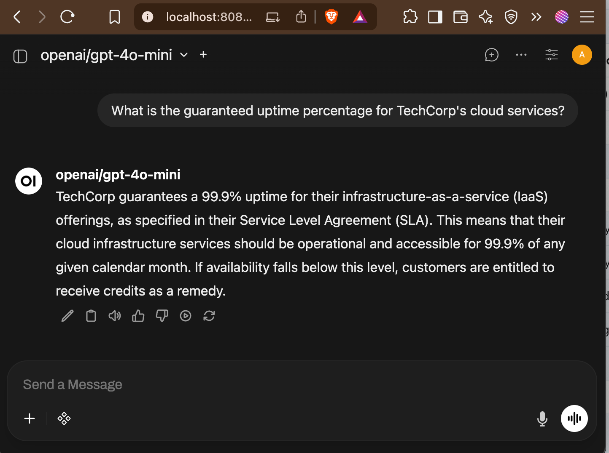

# RAG Agent Query Parser

A FastAPI service that rewrites user queries using archgw and gpt-4o-mini for better retrieval accuracy.

## How it Works

1. Receives a chat completion request with conversation history
2. Calls archgw's LLM gateway with gpt-4o-mini to rewrite the last user query
3. Returns the rewritten query as the assistant response

## Setup and Running

1. **Start archgw with open-web and jaeger ui**:
   ```bash
   docker compose up -d
   ```
1. **Interact with rag agent using open-web-ui**:
   Navigate to http://localhost:8080 and try some sample queries like "What is the guaranteed uptime percentage for TechCorp's cloud services?"

Note: open-web-ui takes some time to load.

Sample screenshot of UI,


